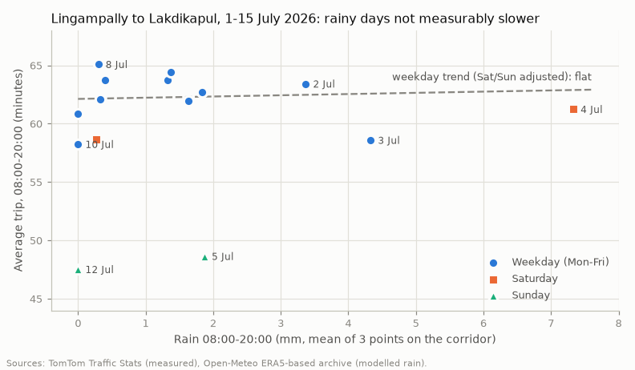

# Rain and the Lingampally → Lakdikapul trip

**Question:** does rain make the 22.5 km trip from Lingampally to Lakdikapul slower, by how much, and on which stretches?
We want a "Rainy day" option in the demo that is backed by real numbers.

**Short answer:** in the first half of July 2026 the light-to-moderate monsoon showers did **not measurably slow the trip**.
On rainy weekdays the trip took **61.0 min** against **62.0 min** on dry weekdays (**−1.6 %**). Our best estimate is that
traffic runs about **5 % slower while it is actually raining**, but the data cannot rule out anything from 11 % faster to
21 % slower. One stretch, **Gachibowli Circle → Biodiversity junction**, was slower on the rainy day in every one of 7
same-weekday comparisons. That is the only stretch-level signal we found.

## What we did (plain language)

1. **Traffic (measured).** TomTom gave us the average trip time for each day from 1 to 15 July 2026, 08:00–20:00, split
   into 12 stretches between junctions (`data/raw/corridor_legs_tomtom.csv`). These are real GPS-probe travel times.
2. **Rain (measured, but modelled).** We downloaded hourly rainfall for July 2026 from the free Open-Meteo archive at
   three points along the route: Lingampally, Gachibowli and Lakdikapul. We averaged the three, because a shower that
   only hits one end of the route still affects part of the trip. The three points fall in three different ~9 km grid
   cells (centres 17.47,78.27 / 17.40,78.37 / 17.40,78.46). Daily totals at the three points were close to each other.
3. **Compare like with like.** Sundays are about 14 minutes faster than weekdays and Saturdays about 3 minutes faster,
   so comparing a rainy Sunday with a dry Tuesday would be unfair. We used three checks:
   - **Weekdays only:** rainy (≥ 2 mm between 08:00 and 20:00) against dry (< 0.5 mm).
   - **Same weekday, one week apart:** 1–7 July was a rainy week and 8–14 July was a dry week, so we compared each day
     with the same weekday in the next week (Wed with Wed, Thu with Thu, and so on).
   - **A regression on all 15 days:** trip minutes against rain, with Saturday and Sunday taken into account.

Script: `data/rain/analyse_rain.py`. Re-run it with `.venv/bin/python -I data/rain/analyse_rain.py`; it downloads with
`curl` and creates no TomTom jobs.

## The numbers

Rain for each day is the 08:00–20:00 total, averaged over the three points.

| Day | Rain (mm) | Wet hours | Trip (min) | | Day | Rain (mm) | Wet hours | Trip (min) |
|---|---|---|---|---|---|---|---|---|
| Wed 1 | 1.6 | 1 | 62.0 | | Wed 8 | 0.3 | 0 | 65.1 |
| Thu 2 | 3.4 | 2 | 63.4 | | Thu 9 | 0.4 | 0 | 63.7 |
| Fri 3 | 4.3 | 2 | 58.6 | | Fri 10 | 0.0 | 0 | 58.2 |
| Sat 4 | 7.3 | 7 | 61.2 | | Sat 11 | 0.3 | 0 | 58.6 |
| Sun 5 | 1.9 | 2 | 48.6 | | Sun 12 | 0.0 | 0 | 47.5 |
| Mon 6 | 1.3 | 1 | 63.8 | | Mon 13 | 0.3 | 0 | 62.1 |
| Tue 7 | 1.8 | 0 | 62.7 | | Tue 14 | 0.0 | 0 | 60.9 |
| | | | | | Wed 15 | 1.4 | 1 | 64.4 |

A "wet hour" is an hour with at least 0.5 mm of rain.

| Check | Result | Is it bigger than normal day-to-day noise? |
|---|---|---|
| Rainy weekdays (n = 2) vs dry weekdays (n = 5) | 61.0 vs 62.0 min, **−1.0 min (−1.6 %)** | No. Dry weekdays alone ranged from 58.2 to 65.1 min (sd 2.6). Permutation p = 0.72 |
| Any-rain weekdays (n = 6) vs dry weekdays (n = 5) | 62.5 vs 62.0 min, +0.5 min (+0.8 %) | No (p = 0.73) |
| Same weekday, rainy week vs dry week (7 pairs) | **+0.6 min (+1.1 %)**, 5 of 7 slower | No (exact sign-flip p = 0.34) |
| Rainiest day, Sat 4 July (7.3 mm, 7 wet hours) vs Sat 11 | +2.6 min (+4.4 %) | A single pair, so we cannot tell |
| Regression, all 15 days | +0.10 min per mm (95 % range −0.61 to +0.82); +0.26 min per wet hour (−0.58 to +1.09) | No. Saturday −3 min and Sunday −14 min are clear |
| **While it is raining** (from the wet-hour regression) | **+5 % travel time** (95 % range −11 % to +21 %) | No |

How we got the "while raining" figure: TomTom's number is an average over 12 hours (08:00–20:00). If rain slows
traffic by X % during one hour, the 12-hour average rises by only about X/12 %. So +0.26 min per wet hour on a
62-minute trip works out to about +5 % during that hour. This assumes trips are spread evenly over the day.

### Stretches

These are weekday minutes. "Rainy week vs dry week" is the average change across the 7 same-weekday pairs.

| Stretch | Dry weekdays | Rainy weekdays | Rainy week vs dry week | Verdict |
|---|---|---|---|---|
| **Gachibowli Circle → Biodiversity jn (j03-j04)** | 2.9 | 4.4 | **+20 % mean, +8 % median, 7 of 7 slower (p = 0.016)** | **Only consistent signal** |
| Masab Tank → Lakdikapul (j11-B) | 5.4 | 5.1 | +6 %, 4 of 7 slower | Mixed. Sat 4 July was +32 % |
| Lingampally → Nallagandla jn (A-j01) | 8.4 | 8.8 | +8 %, 6 of 7 slower | Not real: the next stretch moves the opposite way (see below) |
| Nallagandla jn → ISB Rd (j01-j02) | 14.4 | 13.1 | −4 % | Lingampally → ISB Rd as a whole: +0.3 % |
| All other stretches | | | −5 % to +2 % | No effect |

The Lingampally stretch looks rain-sensitive on its own, but the next stretch (Nallagandla → ISB Rd) gets faster by about
the same amount. Where the time is split between the two depends on where the Nallagandla junction sits on TomTom's
road segments. Taken together, the two stretches show no change.

Gachibowli Circle → Biodiversity junction is a 1.6 km stretch that includes the flyover approach. It was slower in all
7 rainy-week pairs, including +70 % on Thu 2 July. With 12 stretches tested, one hit like this could still be chance,
so treat it as "worth watching", not proven.

## Recommended rain setting for the simulation

`data/rain/rain_factors.json` (label: **estimated**):

| Setting | Value | Meaning |
|---|---|---|
| `overall_speed_factor` | **0.95** | Multiply road speeds by 0.95 while it rains, so trips take about 5 % longer. This is our best estimate |
| `per_leg["j03-j04"]` | **0.83** | Gachibowli Circle → Biodiversity jn runs about 20 % slower. Every other stretch uses 0.95 |
| `stress_test.overall_speed_factor` | **0.83** | A pessimistic "heavy rain" what-if (+21 %, the top of the 95 % range). Do not use it as the expected case |
| `demand_factor` | **1.0** | We have no evidence that rain changes how many vehicles travel, so we keep demand unchanged (assumed) |

**Confidence: low.** The "Rainy day" option in the demo should say something like *"Based on 15 days of TomTom data for
July 2026, light monsoon showers added about 5 % to this trip (not statistically certain). The Gachibowli → Biodiversity
stretch was the most rain-sensitive."* We should not claim that rain causes big delays on this corridor. The data we have
does not show that.

## Caveats

- **Small sample.** There are 15 days, and only 2 weekdays had ≥ 2 mm of rain. Normal day-to-day variation (±2.6 min) is
  bigger than any rain effect we could see.
- **Daily averages vs hourly rain.** TomTom gives one average for 08:00–20:00, while rain usually falls for one or two
  hours. A strong but short slowdown gets diluted in a 12-hour average. The "+5 % while raining" figure is derived, not
  measured hour by hour.
- **Light rain only.** The rainiest day in our window had 7.3 mm in 12 hours. The really wet days in July (17th: 13 mm,
  29th: 10 mm, 30th: 13 mm in 08:00–20:00) are outside the period TomTom covered day by day, so we cannot say anything
  about heavy rain or waterlogging.
- **The rain data is a weather model, not a rain gauge.** Open-Meteo's archive is ERA5-based reanalysis on a grid of
  about 9 km. It gets total rainfall roughly right but often misplaces the timing and location of short convective
  showers. Data from a rain gauge (IMD, or the Telangana State Development Planning Society AWS network) would be
  better.
- **Week-to-week effects.** The same-weekday comparison assumes nothing else changed between the first and second week
  of July, such as events or roadworks.
- **TomTom average vs median.** We used the average trip time. The median trip time gives the same picture
  (rainy weekdays 48.5 vs dry 49.2 min).

## How to firm this up (not done; needs one TomTom job, and the account is at 19 of 20)

One Traffic Stats job on the same route, with date ranges for 17, 21–22, 29 and 30 July (wet) and 10, 13–14, 24 July
(dry), and one-hour time sets from 08:00 to 20:00. That would let us compare rainy hours with dry hours directly, and
include the heavy-rain days.

## Files

| File | What | Label |
|---|---|---|
| `data/raw/rain_july_hyderabad.csv` | Hourly precipitation and rain at the 3 points plus their mean, 1–31 July 2026 (IST) | measured (ERA5-based reanalysis) |
| `data/raw/corridor_rain_vs_trip.csv` | One row per day, 1–15 July: weekday, rain 08:00–20:00 (mean and per point), wet hours, 24 h rain, trip minutes (average and median), minutes per stretch | trip measured; rain measured (modelled) |
| `data/rain/rain_factors.json` | Recommended simulation setting | estimated |
| `data/rain/rain_vs_trip.png` | The chart above | |
| `data/rain/analyse_rain.py` | Re-creates all of the above | |
