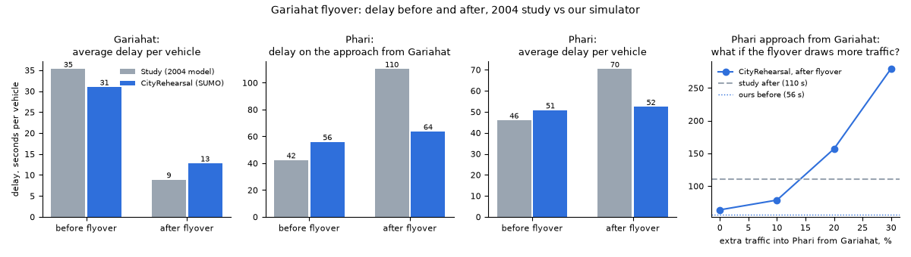

# Gariahat backtest: does CityRehearsal predict what a real flyover did?

**What we tested.** In 2004, IIT Kharagpur (Maitra et al., `data/gariahat/`) modelled the Gariahat flyover in Kolkata
before it opened. They found that it would cut delay at Gariahat crossing by three quarters, but would more than double
the delay at Ballygunge Phari, the next junction north, because traffic would now pour off the flyover without stopping.
Across both junctions, the flyover would make things worse. We gave our simulator the same two road layouts (with
and without the flyover) and the same counted traffic, and checked whether it reaches the same conclusions.

**Result in one sentence.** Our simulator reproduces the big win at Gariahat (delay down 59%, study 75%) and the
direction of the knock-on at Phari (the road from Gariahat gets slower), but not its size: with the same counted
traffic, Phari's approach from Gariahat gets 14% slower, not 160%. It matches the study's Phari figure only if the
flyover also brings about 15% more traffic onto that road, which the study expects but does not put a number on.

**Verdict: partial match.** The direction is right everywhere, and the Gariahat size is right. Phari's size, and so the
"worse overall" conclusion, only follow if the flyover attracts extra traffic.



## The comparison (3 random seeds; seed-to-seed spread under ±3 s)

| What the study reported | Study before → after | Change | Ours before → after | Change | Verdict |
|---|---|---|---|---|---|
| Gariahat: average delay per vehicle | 35.3 → 8.9 s | −75% | 31.0 → 12.8 s | −59% | match |
| Phari: delay on the approach from Gariahat | 42.4 → 110.3 s | +160% | 56.0 → 63.7 s | +14% | partial (direction only) |
| Phari: average delay per vehicle | 46.0 → 70.4 s | +53% | 50.8 → 52.4 s | +3% | partial (direction only) |
| Gariahat: peak-hour delay | 38.1 → 9.7 veh-h | −75% | 33.5 → 13.8 veh-h | −59% | match |
| Phari: peak-hour delay | 74.4 → 132.6 veh-h | +78% | 82.2 → 84.8 veh-h | +3% | partial |
| Both junctions together | 112.5 → 142.3 veh-h | +26% | 115.7 → 98.6 veh-h | −15% | mismatch |

"Match" means the same direction and a change between half and double the study's. Vehicle-hours are worked out the
study's way: average delay × the counted peak-hour volume (3,886 vehicles at Gariahat, 5,824 at Phari).

**Before the flyover, our starting point is close to the study's** (per approach, seconds of delay):

| | Gariahat A | B | C | D | Phari A | B | C | D | E |
|---|---|---|---|---|---|---|---|---|---|
| Study (Tables 5, 6) | 37.1 | 35.7 | 41.2 | 23.8 | 37.1 | 52.1 | 42.4 | 77.8 | 29.3 |
| Ours | 33.4 | 29.9 | 29.2 | 31.6 | 38.4 | 48.2 | 56.0 | 75.1 | 48.4 |

After the flyover, at Gariahat: study (Table 8, traffic left at street level) A 11.2, B 23.1, C 13.7, D 17.6 s; ours A 9.1,
B 18.8, C 8.1, D 19.6 s. Our A and C also include the flyover users, who lose almost nothing. End-to-end trips along
Gariahat Road through both junctions get faster in our runs: 326 → 283 s on average.

## Why Phari doesn't jump in our run, and what it would take

The flyover does not add vehicles by itself. Before the flyover, Gariahat's signal was busy but not overloaded (queues
under 100 m), so it was not holding traffic back: the same ~1,530 vehicles an hour reached Phari before and after.
They now arrive in a steadier stream rather than in bunches, which costs Phari's approach a few seconds, not a minute.
The study's large jump rests on its statement that the flyover "will increase substantially" the inflow to Phari. So we
added that as a what-if, with more traffic arriving at Phari from Gariahat after the flyover:

| Extra traffic into Phari from Gariahat | 0% | +10% | +20% | +30% |
|---|---|---|---|---|
| Delay on Phari's approach from Gariahat | 64 s | 79 s | 157 s | 280 s |
| Phari average delay | 52 s | 57 s | 81 s | 120 s |
| Longest queue on that approach | 143 m | 190 m | 359 m | 533 m |

The study's 110 s falls at about **+14%**. Past +20%, Phari's approach tips over its capacity and the queue heads back
towards Gariahat (930 m away). Flyovers commonly pull traffic off parallel roads, so +10–20% is plausible. That is the
honest pitch line: *"Our simulator agrees the flyover fixes Gariahat. It also shows Phari is the next bottleneck: if
the flyover draws even 15% more traffic onto Gariahat Road, Phari's approach delay doubles, as the 2004 study warned."*

## What went in (labels as in CLAUDE.md)

| Input | Value | Label |
|---|---|---|
| Vehicles per approach and class, peak hour | Study Table 3 (car, two-wheeler, bus, minibus, auto) | counted |
| Left / straight / right shares | Study Table 4 | counted |
| Same traffic before and after | The study re-routes the same counts; straight traffic on A and C uses the flyover (Table 7: 2,031 veh/h) | counted |
| Approach widths | Study Table 3; lanes = width / 3 m, rounded down (min 2), using the full width | counted / assumed |
| Which study letter is which road | Gariahat A = from Phari (north), B = west, C = south, D = east. Phari A = Hazra Rd, B = Ballygunge Circular Rd, C = from Gariahat, D = Broad St, E = Gariahat Rd north. Chosen so the junctions' flows balance (within 30–100 veh/h) and widths fit road sizes | estimated |
| Side street between the junctions | Tops up Phari's approach from Gariahat to its count (+98 veh/h) and Gariahat's approach from Phari (+27 veh/h) | estimated |
| Phase groups | Gariahat: 2 phases, Gariahat Rd / Rash Behari Ave (paper). Phari: 3 phases (paper): Gariahat Rd (C+E), Hazra Rd + Ballygunge Circular Rd (A+B), Broad St (D). The grouping is ours: it fits the paper's before delays (Table 6) | estimated |
| Signal timing | 150 s cycle everywhere (the paper's only reported cycle); greens split by the busiest approach in each phase, in passenger-car units per lane; Phari unchanged by the flyover, as in the paper | assumed |
| Driver behaviour | Close following and two-wheelers filtering between cars (SUMO sublane model), the YMCA settings | assumed |
| Turning inside the junction box | Vehicles obey the lights but don't give way to each other once green, like the study's model, which simulated each approach on its own | assumed |
| Flyover | 2 lanes each way, 50 km/h, landings where OpenStreetMap has them (~300 m south, ~360 m north of the crossing) | counted (OSM) / assumed |
| Arrivals | Random (Poisson) over a 10-minute warm-up plus the peak hour; queued vehicles are followed until they clear | assumed |

## Caveats

- **The study's "after" numbers are a model too.** The flyover was under construction when they counted, and their
  model was checked against field delays at nearby Deshpriya Park (within ~10%). This backtest compares two simulators
  on the same inputs. It is not a check against post-flyover field data. Say "reproduces the study's finding".
- **Signals and approach letters are our reconstruction.** The paper doesn't give its green times or a map of
  letters to roads. Different splits move individual approaches by 10–20 s. The Gariahat result held in every
  version we tried. The Phari result depends on Phari sitting just under capacity, which our before run reproduces
  (Phari 50.8 s vs 46.0 s).
- **Two approaches start off.** Phari C begins at 56 s against the study's 42 s, and Phari E at 48 s against 29 s. We
  start somewhat more congested on the very approach the claim is about.
- **Turning conflicts are simplified.** With SUMO's strict give-way rules, right-turners waiting for gaps in a saturated
  oncoming stream blocked whole lanes, and Phari locked up even before the flyover (run with `CR_JTYPE=traffic_light`
  to see it). We let green movements weave through, as the study did. SUMO logs ~250 "touches" per run where two
  green streams merge into one exit lane. Vehicles carry on; this is a bookkeeping artefact, not a crash model.
- **Schematic roads.** We use a purpose-built network (13 nodes: the two junctions, the roads the study counted
  out to 300–600 m, one side street), not `sim/networks/gariahat_*.net.xml`. Those OSM conversions have no traffic
  lights at all after conversion (0 signals) and ~2,000 side-street edges. Buses don't stop, there are no
  pedestrians, and parking and the market at Gariahat are not modelled.
- **Peak hour only.** Effects across a whole day, and traffic switching routes, are outside this test. The +10–30%
  what-if stands in for the second.

## How to re-run

```bash
CR_SIM_OUT=/tmp/cr python sim/gariahat/backtest.py            # 3 seeds + what-if runs (15 SUMO runs, ~5 min on 8 cores)
CR_SIM_OUT=/tmp/cr python sim/gariahat/backtest.py --frames   # also writes 3D replay frames (below)
python sim/gariahat/backtest.py --seeds 1 --no-sensitivity --no-write   # quick check, ~1 min, prints only
```
Each SUMO run takes ~90 s: 1 h 10 min of traffic plus clearing, 0.5 s step, sublane model on (lateral resolution
0.8 m). The script rebuilds `net/gariahat_{before,after}.net.xml` (plain XML → netconvert, with our signal plans in
`net/*.tll.xml`), writes `results.json` and `chart.png`, and deletes the bulky SUMO outputs.

**3D replay (C1 frames).** `--frames` writes `$CR_SIM_OUT/gariahat/frames_before.jsonl` and `frames_after.jsonl`
(not committed; ~12–13 MB each). Each has 4 minutes at one frame per second (t = 1200–1439 s, seed 1) in the C1 format
of `contracts/vehicle_frame.schema.json`. Vehicles on the flyover get `z` up to 6 m, ramping over 80 m at each end;
minibuses are typed `bus`. The coordinates are Kolkata (Gariahat ≈ 88.3653 E, 22.5197 N), so the 3D view needs its
camera moved there.

## Files

| File | What |
|---|---|
| `backtest.py` | Builds both networks, the traffic and the detectors, runs SUMO, measures, compares, charts |
| `results.json` | `comparison` (the table above), `before` / `after` (C2-style run results with per-approach detail and the study's numbers alongside), `sensitivity_after_flyover` |
| `chart.png` | The three delay comparisons plus the what-if curve |
| `net/` | The before and after networks and their signal plans (small, regenerated on every run) |

Measurement: one entry-to-exit detector per study approach, from the start of the approach road (or Phari's approach
from Gariahat, the whole 930 m link) to just past the stop line. Delay = SUMO time loss, plus any wait to enter the
model if a queue reaches its edge. Flyover users count at Gariahat from the start of their approach to the start of the
flyover, so they count with near-zero delay, as in the study.
